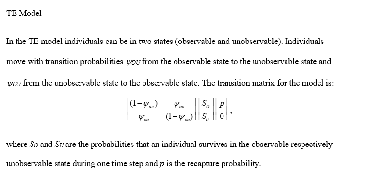

# SimulaTEr 

A program to simulate capture-recapture histories under the TE (temporary emigration) model. 
Please note: The program runs under Windows only. To run it, simply copy SimulaTEr.exe to a folder on your hard drive folder and double-click it.

SimulaTEr creates a Mark[MARK](http://www.phidot.org/software/mark/) compatible simulation sim (.sim), which can be run using MARK as a command line tool (see instructions within SimulaTEr).

Reference:

Henle & Gruber (accepted). Performance of multistate mark-recapture models for temporary emigration in the presence of survival costs. *Methods in Ecology and Evolution*